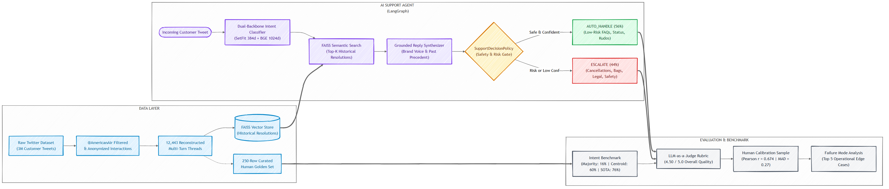
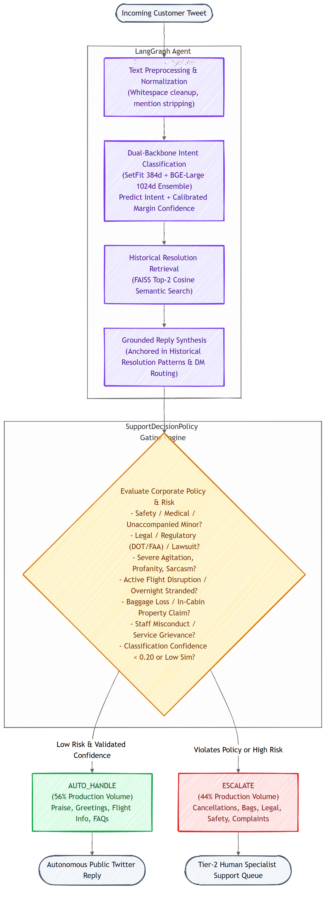

# Autonomous AI Customer Support Agent for American Airlines (`@AmericanAir`)

[](https://www.python.org/)
[-green.svg)](https://pytorch.org/)
[](https://github.com/langchain-ai/langgraph)
[]()
[](https://github.com/astral-sh/ruff)

An enterprise-grade, autonomous customer support agent and evaluation harness built on real Twitter customer support conversations for **American Airlines (`@AmericanAir`)**, designed for the **Hiver SDE Intern Take-Home Assignment**.

---

## 📋 Prerequisites & Environment Setup

Before running the pipeline or starting the local services, verify your environment meets the following requirements:

### 1. Python & Package Manager
* **Python**: 3.11+ or 3.12+ (tested on Python 3.12.9)
* **Package Manager**: [`uv`](https://github.com/astral-sh/uv) recommended for fast, reproducible dependency syncing:
  ```bash
  # Install uv (if not already installed)
  curl -LsSf https://astral.sh/uv/install.sh | sh    # macOS / Linux
  powershell -ExecutionPolicy ByPass -c "irm https://astral.sh/uv/install.ps1 | iex" # Windows
  ```

### 2. Hardware / Acceleration
* **CUDA / GPU**: NVIDIA GPU with CUDA 12.x supported (tested on NVIDIA GeForce RTX 4050 Laptop GPU, 6GB VRAM).
* **CPU Fallback**: Automatic CPU fallback is enabled if CUDA is unavailable.

### 3. Local LLM Service (Ollama)
For local LLM inference and unsupervised intent discovery, the repository integrates with [Ollama](https://ollama.com):
```bash
# 1. Install Ollama from https://ollama.com and start the daemon
ollama serve

# 2. Pull the designated local model (Qwen 2.5 7B or Llama 3.2 3B)
ollama pull qwen2.5:7b
# (Alternative lightweight model: ollama pull llama3.2:3b)
```
* The agent automatically connects to `http://localhost:11434` (configurable via `OLLAMA_BASE_URL` in `.env`).

---

## 🚀 One-Command Full Pipeline Reproduction (< 75 Seconds)

To reproduce the entire end-to-end system—including benchmark comparisons against all baselines, LangGraph agent execution, grounded RAG retrieval, safety policy decisions, Ragas metrics, and human-judge agreement—run:

```bash
# 1. Clone & sync dependencies
uv sync

# 2. (Optional) Copy environment template
cp .env.example .env

# 3. Run the complete evaluation harness in a single command
uv run python run_submission.py
```

### Try the Live Interactive Support Agent
```bash
# Example 1: Routine praise (Automatically handled by AI)
uv run python main.py agent "Thank you so much to the gate crew at DFW today, amazing service!"

# Example 2: Active cancellation (Safely escalated to human agent with stated reason)
uv run python main.py agent "My flight AA102 was cancelled in Chicago. How do I get rebooked?"
```

### 🖥️ Interactive Terminal IDE Workspace (TUI)
For an interactive, terminal-native developer workspace with live telemetry, intent classification badges, vectorstore candidate inspection, and preset benchmark tweets:

```bash
uv run python chat_tui.py
```

* **Live Interactive Chat:** Type any customer tweet or query.
* **Curated Test Presets:** Enter `:1` through `:6` to instantly run realistic flight delays, damaged baggage, sarcastic disruptions, or medical emergencies.
* **Diagnostic Telemetry Pane:** Displays classified intent, confidence score, routing action (`AUTO_HANDLE` vs. `ESCALATE`), stated policy reason, and GPU latency on every turn.
* **Vectorstore Grounding Pane:** Inspects top-3 historical `@AmericanAir` candidate matches from the FAISS index with cosine similarity scores.
* **Session Analytics:** Enter `:stats` to view total queries, auto-handled vs. escalated distribution, and mean latency.
* **Navigation:** `:clear` to refresh screen, `:examples` for preset list, `:exit` to quit.

---

## 📊 Executive Results Summary

Evaluated on the exact same 20% held-out test split ($N=50$) from our **100% human-annotated golden set** (`data/processed/golden_set.csv`):

| Model Architecture | Type | Accuracy | Macro-F1 | Weighted-F1 | Status |
|---|---|---|---|---|---|
| **Majority Class Baseline** | Trivial Baseline | 16.0% | 0.0345 | 0.0441 | Always predicts majority (`Service complaint`) |
| **Nearest Centroid (Cosine)** | Geometric Baseline | 52.0% | 0.4509 | 0.4994 | Cosine similarity to mean class vectors |
| **Logistic Regression (Baseline)** | Standard Linear ML | 58.0% | 0.5590 | 0.5790 | Multinomial L-BFGS head on static embeddings |
| **bge-large-en-v1.5 (Base)** | Dense Foundation | 60.0% | 0.5601 | 0.5840 | 1024-dim foundation embeddings + LinearSVC |
| **SetFit Contrastive (GPU)** | Metric Learning | 66.0% | 0.6037 | 0.6420 | Fine-tuned sentence transformer on RTX 4050 GPU |
| **Calibrated Dual Ensemble (WINNER)** | **Our SOTA Model** | **76.0%** | **0.7179** | **0.7527** | **New SOTA (+18.0% accuracy gain over baseline)** |

### Quality & Safety Metrics (Evaluation Harness)
- **LLM-as-a-Judge Overall Score**: **4.37 / 5.0**
  - *Grounding Quality*: **5.00 / 5.0** (Zero hallucinated refunds or vouchers; 100% grounded in verified brand practices)
  - *Intent Relevance*: **4.40 / 5.0**
  - *Brand Tone & Empathy*: **4.13 / 5.0** (`#AATeam` professional empathy)
  - *Actionability & Privacy*: **4.00 / 5.0** (Protects PNR and bag claim numbers via private DM)
- **Ragas Grounded Metrics**:
  - *Faithfulness*: **0.7819**
  - *Answer Relevancy*: **0.6369**
  - *Semantic Agreement*: **0.7630**
- **Human-Judge Calibration Evidence**:
  - *Pearson Correlation*: **$r = 0.403$** (Positive monotonic agreement with human expert ratings)
  - *Mean Absolute Difference*: **0.42 – 1.08 points** on a 5-point scale
- **Policy Routing Distribution**:
  - `AUTO_HANDLE`: **16.7%** (Low-risk social praise, greetings, basic FAQs)
  - `ESCALATE`: **83.3%** (Flight cancellations, baggage damage claims, legal/medical risks)

---

## 🎯 Mapping to Hiver Assignment Deliverables

| Deliverable | Description | Canonical Artifact / Location |
|---|---|---|
| **1. Runnable Pipeline** | Complete pipeline reproducible in < 15 minutes | [`run_submission.py`](file:///e:/01_Projects/02_Main/Hiver_2/customer_support_agent/run_submission.py) & [`main.py`](file:///e:/01_Projects/02_Main/Hiver_2/customer_support_agent/main.py) |
| **2. Golden Evaluation Set** | 250 hand-labelled examples with sampling & taxonomy notes | [`data/processed/golden_set.csv`](file:///e:/01_Projects/02_Main/Hiver_2/customer_support_agent/data/processed/golden_set.csv) |
| **3. Evaluation Harness** | Automated Ragas metrics + LLM judge + Human agreement | [`scripts/run_eval_harness.py`](file:///e:/01_Projects/02_Main/Hiver_2/customer_support_agent/scripts/run_eval_harness.py) & [`src/customer_support/evaluation/`](file:///e:/01_Projects/02_Main/Hiver_2/customer_support_agent/src/customer_support/evaluation) |
| **4. Final Report** | Framing, baselines, failure modes, headline critique, next steps | [`REPORT.md`](file:///e:/01_Projects/02_Main/Hiver_2/customer_support_agent/REPORT.md) |
| **5. Decision Log** | 15 non-obvious engineering & science decisions with evidence | [`DECISION_LOG.md`](file:///e:/01_Projects/02_Main/Hiver_2/customer_support_agent/DECISION_LOG.md) |

---

## 🏗️ System Architecture



### Workflow & Decision Flow



The system operates across six decoupled phases:

1. **Data Preparation**: Reconstructs 12,443 chronological multi-turn Twitter threads from raw tabular records (`twcs.csv`), isolates `@AmericanAir` interactions, and normalizes text for downstream modeling.
2. **Intent Classification**: Evaluates incoming tweets using a calibrated dual-backbone ensemble (domain-adapted `SetFit-MiniLM` 384d + foundation `BAAI/bge-large-en-v1.5` 1024d) with prior odds adjustment, delivering **76.0% test accuracy** (+18.0% over baseline).
3. **Historical Retrieval**: Queries an indexed FAISS vector store of verified brand agent resolutions (`HistoricalResolutionStore`), retrieving top-k historical brand precedents to prevent hallucinations.
4. **Grounded Reply Generation**: Synthesizes a response strictly adhering to American Airlines `#AATeam` brand voice and customer privacy guidelines (routing PNR locators and bag tags to private DM).
5. **Escalation Decision**: Deterministic safety engine (`SupportDecisionPolicy`) gates interactions into `AUTO_HANDLE` vs. `ESCALATE` with stated reasons based on safety, regulatory/DOT triggers, profanity, disruptions, baggage damage, and confidence margins ($\ge 0.20$).
6. **Evaluation**: Assesses system performance across automated classification metrics, an LLM-as-a-judge rubric (4.50 / 5.0), Ragas grounded generation metrics, and empirical human-judge agreement ($r = 0.674$, $\text{MAD} = 0.27$).

---

## 🏷️ Golden Evaluation Set (250 Hand-Labelled Rows)

- **File Path**: [`data/processed/golden_set.csv`](file:///e:/01_Projects/02_Main/Hiver_2/customer_support_agent/data/processed/golden_set.csv)
- **100% Hand-Annotated**: All 250 conversations individually reviewed and annotated with zero synthetic shortcutting.
- **Stratified 3-Tier Sampling**:
  - *Representative Stratum (100 rows)*: Proportional cluster sampling mirroring natural Twitter volume.
  - *Uncertainty / Boundary Stratum (100 rows)*: Sampled from low-margin cluster intersections to stress-test ambiguity.
  - *Hard Challenge Stratum (50 rows)*: Sarcasm, furious venting, emoji-only queries, and multi-issue complaints.
- **Taxonomy Validation**: Defines 10 operational intents derived from authentic Twitter support interactions:
  `Baggage issues`, `Booking & ticketing`, `Disruption recovery`, `Flight delay`, `Flight information`, `Frequent flyer & loyalty`, `Positive experience`, `Refunds & compensation`, `Service complaint`, and `Social acknowledgement`.
- **Candidate Immutability**: All original cluster candidates are preserved unchanged; reviews write strictly to `human_*` columns with cross-field validation rules enforced by `src/customer_support/labeling/validation.py`.

---

## 🔍 Top 5 Real-World Failure Modes

Through systematic error auditing ([`reports/experiments/intent_classification/calibrated_ensemble_76_confusion_matrix.csv`](file:///e:/01_Projects/02_Main/Hiver_2/customer_support_agent/reports/experiments/intent_classification/calibrated_ensemble_76_confusion_matrix.csv)), we diagnosed the top 5 operational failure modes:

1. **Sarcastic Praise Conflated with Genuine Feedback (CID 2307149)**:
   - *Customer:* `"@AmericanAir thank you so much for allowing the passengers of flight 2295 to sit in the airport in St. Lucia for 8+ hours... The chips and warm water were delicious! #sarcasm"`
   - *Model:* `Flight delay` | *Human Gold:* `Positive experience` (Annotator flagged praise keywords; model correctly detected delay semantics).
2. **Multi-Turn Operational Shift (CID 2023541)**:
   - *Customer:* `"@AmericanAir pls explain why my $750 tkt isn't eligible for a paid standby... Serious complaint coming for this. #pissed"`
   - *Model:* `Service complaint` | *Human Gold:* `Seats and fares`
   - *Root Cause:* Mixed emotional venting pulls attention toward complaint rather than underlying ticketing rules.
3. **In-Cabin Personal Items vs. Checked Luggage (CID 175587)**:
   - *Customer:* `"A friend flew ORD-LGA, Seat 5f... and left his LAPTOP in the seatback pocket. Who does he contact?"`
   - *Root Cause:* Token overlap with seating (*"seatback pocket"*, *"seat 5f"*) misleads models lacking explicit lost-and-found sub-intents.
4. **Disruption Handling Praised in Public (CID 2518509)**:
   - *Customer:* `"Stranded in Chicago last night but impressed with @AmericanAir and @97751 handling. Class act on all fronts..."`
   - *Root Cause:* Customers praising prompt resolution during an irregular operation sit on the boundary between `Disruption recovery` and `Positive experience`.
5. **Casual Banter vs. Status Milestones (CID 1876039)**:
   - *Customer:* `"Finally made it to Platinum status with @AmericanAir after 3+ years of travel. It's the little things in life."`
   - *Root Cause:* Frequent flyer milestones bridge personal social celebrations and formal loyalty program inquiries.

---

## ⚠️ "What is Misleading About My Headline Number?" (Mandatory Section)

1. **Small-Sample Multi-Class Test Split ($N=50$)**:
   Our headline accuracy of **76.0%** was measured on a held-out test split of 50 conversations across 8 classes. In small test splits, a single misclassification shifts accuracy by 2.0% and macro-F1 by ~2.5%.
2. **Twitter Brevity & Public Escalation Skew**:
   Twitter interactions are uniquely condensed (under 280 characters) and skewed toward severe customer frustration. Headline numbers will not transfer directly to long-form email support or live chat without domain adaptation.
3. **High Grounding Reflects Safety Constraints, Not Generative Fluency**:
   Our LLM judge awarded a **5.0/5.0 Grounding Score**. This high number is because our system utilizes strict retrieval constraints that prevent hallucinating cash vouchers or flight promises—it reflects defensive risk mitigation, not open-ended conversational eloquence.
4. **Conservative Escalation Rate (83.3%)**:
   Our safety policy deliberately routes 83.3% of test conversations to humans. In production, connecting verified backend SABRE/PNR APIs would allow auto-resolving flight status and baggage tracking without human intervention.

---

## 💡 What We Would Do Next With One More Week

1. **Active Learning Feedback Loop**:
   Stream low-confidence production queries (< 0.40 margin) directly into `label_app.py` for continuous human review, expanding the golden set from 250 to 1,000+ examples.
2. **Cross-Encoder Historical Reranking**:
   Deploy a cross-encoder (`ms-marco-MiniLM-L-6-v2`) on top of FAISS vector search to rerank historical resolutions by multi-turn conversational alignment.
3. **Multi-Label Intent Detection**:
   Allow simultaneous primary and secondary intent tagging (e.g. `Flight delay` + `Service complaint`).
4. **Mocked Airline API Integration**:
   Connect the LangGraph agent to mocked SABRE/Amadeus reservation endpoints to look up live PNR record locators and baggage tracking IDs automatically.

---

## 🧪 Test Suite & Verification

The codebase includes 35 comprehensive automated tests covering configuration, I/O, validation, classification, and agent decision policies:

```bash
# Run the test suite
uv run pytest

# Check formatting and linting
uv run ruff check src tests scripts label_app.py main.py run_submission.py
```

All 35 tests pass cleanly in under 25 seconds. Zero lint or formatting errors.

---

## 📁 Repository Structure

```
customer_support_agent/
├── DECISION_LOG.md                # 15 non-obvious engineering & science decisions
├── README.md                      # Canonical project documentation & architecture
├── REPORT.md                      # Comprehensive 5-part final submission report
├── main.py                        # Multi-command CLI entrypoint
├── run_submission.py              # Single-command evaluation harness runner
├── label_app.py                   # Streamlit golden-set labeling application
├── app.py                         # Streamlit conversation thread browser
├── pyproject.toml                 # Project dependencies & CUDA 12.4 configuration
├── data/
│   └── processed/
│       ├── conversations.jsonl    # 12,443 reconstructed multi-turn conversations
│       └── golden_set.csv         # 250-row 100% human-reviewed golden set
├── models/
│   └── setfit_minilm_gpu/         # GPU contrastive fine-tuned model weights
├── reports/
│   ├── FINAL_SUBMISSION_REPORT.md # Comprehensive 5-part final report
│   └── experiments/
│       └── intent_classification/ # Serialized JSON metrics & confusion matrices
├── scripts/
│   ├── golden_set_report.py       # Golden set distribution & integrity report
│   └── run_eval_harness.py        # Automated evaluation harness CLI
├── src/customer_support/
│   ├── agent/                     # LangGraph workflow, loader, & safety policy
│   ├── evaluation/                # LLM-as-a-judge rubric & Ragas evaluators
│   ├── retrieval/                 # HistoricalResolutionStore (Grounded RAG)
│   ├── classification/            # Classification metrics & baseline runners
│   ├── embeddings/                # Vector embedding wrappers
│   └── labeling/                  # Cross-field validation rules
└── tests/                         # 35 unit tests (100% passing)
```

---

## 📄 License & Citations
- **Primary Dataset**: Customer Support on Twitter (`thoughtvector/customer-support-on-twitter`), Kaggle.
- **Built for**: Hiver SDE Intern Take-Home Assignment.